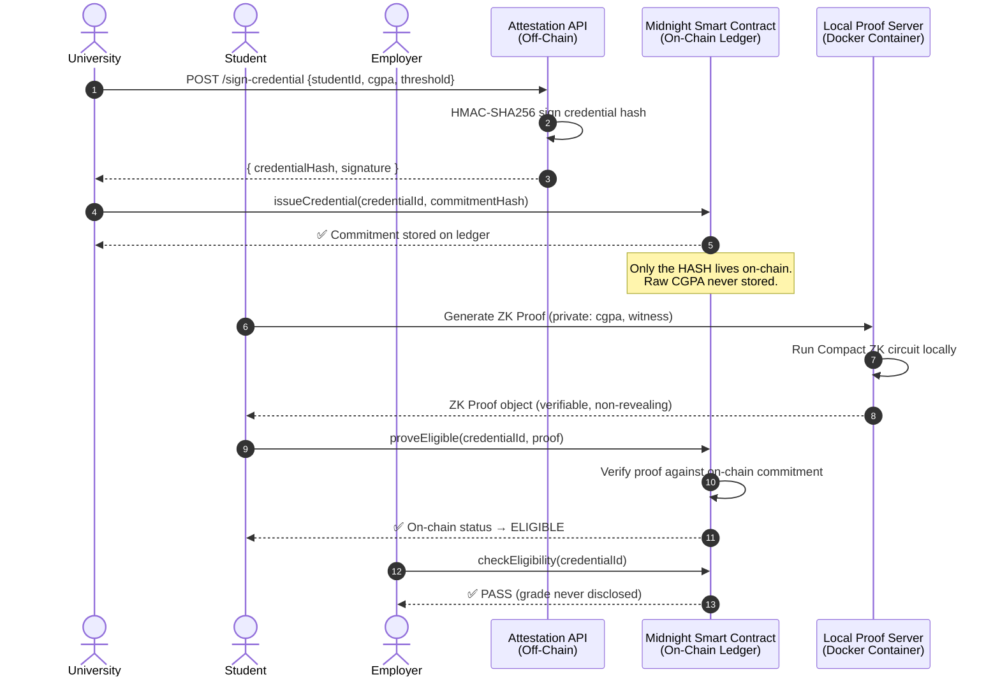
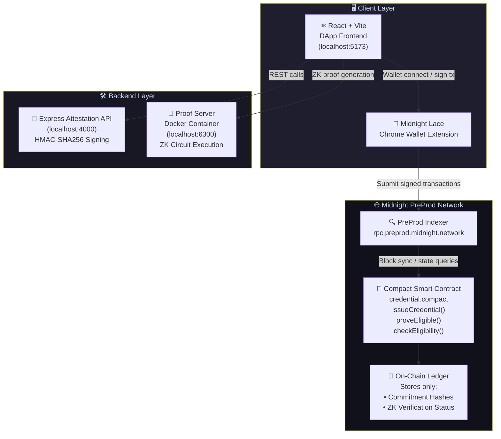

<div align="center">

# 🌌 Cygnus

### Zero-Knowledge Academic Credential Wallet on Midnight Network

*Prove you qualify. Reveal nothing else.*

[](https://midnight.network)
[](https://docs.midnight.network)
[](https://react.dev)
[](https://www.typescriptlang.org)
[](LICENSE)

---

**Brainwave 2026 — Midnight Blockchain Track**

[🔗 Live Contract](#-live-deployment) · [📐 Architecture](#-system-architecture) · [⚙️ Setup](#️-installation--setup) · [🎬 Demo](#-demo-workflow) · [🧠 How ZK Works](#-how-zero-knowledge-proofs-work)

</div>

---

## 🧩 The Problem

Every year, millions of students hand over their **entire academic transcript** to employers or universities just to answer a single binary question:

> *"Do you meet the minimum CGPA requirement?"*

This exposes **everything** — failed courses, personal grades, irrelevant subjects, retake history — to a third party who only needed one data point. Traditional systems have no concept of selective disclosure.

---

## ✨ The Solution — Cygnus

**Cygnus** is a privacy-preserving academic credential system built on the **Midnight Network**, the first blockchain with native privacy built into the consensus layer.

Using **Zero-Knowledge cryptography** and **Compact smart contracts**, Cygnus enables a paradigm shift:

| Role | What They Do | What They Reveal |
|---|---|---|
| 🏛️ **University (Issuer)** | Signs & publishes a cryptographic commitment of the student's grade | Only a hash. Raw grade stays off-chain. |
| 🎓 **Student (Holder)** | Generates a ZK proof locally that grade ≥ threshold | Nothing. Proof is computed entirely on-device. |
| 🏢 **Employer (Verifier)** | Reads the on-chain verified status | Only `PASS` or `FAIL`. Never sees the grade. |

---

## 🔬 How Zero-Knowledge Proofs Work

The core of Cygnus is a **ZK circuit** written in Compact — Midnight's purpose-built smart contract language. Here is the end-to-end cryptographic lifecycle:



---

## 🏗️ System Architecture



---

## 📁 Project Structure

```
Cygnus/
│
├── 📜 contract/                   # Compact smart contract
│   ├── src/
│   │   ├── credential.compact     # ZK circuits: issue, prove, verify
│   │   └── managed/               # Compiled keys & TypeScript bindings
│   ├── package.json
│   └── tsconfig.json
│
├── 📡 api/                        # Express Attestation API (off-chain signer)
│   ├── src/
│   │   ├── server.ts              # Route handlers (POST /sign-credential)
│   │   └── index.ts               # Server entrypoint
│   ├── .env.example
│   └── package.json
│
├── ⚛️ frontend/                   # React + Vite DApp
│   ├── src/
│   │   ├── components/
│   │   │   ├── ConnectWallet.tsx   # Midnight Lace wallet connector
│   │   │   ├── IssuerPanel.tsx     # University credential issuance UI
│   │   │   ├── StudentWallet.tsx   # Student ZK proof generation UI
│   │   │   └── VerifierPanel.tsx   # Employer verification panel
│   │   ├── contexts/
│   │   │   └── MidnightContext.tsx # Global wallet & contract state
│   │   ├── App.tsx
│   │   ├── main.tsx
│   │   └── styles.css             # Glassmorphism dark theme
│   └── package.json
│
├── 🔧 cli/                        # CLI deployment utilities
│   └── src/deploy.ts              # Network config & node mapping
│
├── 🚀 preprod-deploy/             # Midnight deployment runner
│   ├── contracts/                 # Template hello-world contract
│   ├── src/
│   │   ├── setup.ts               # Wallet init, sync, faucet detection
│   │   ├── deploy.ts              # Contract deployment logic
│   │   └── wallet.ts              # Wallet & DUST token management
│   ├── docker-compose.yml         # Local Midnight proof server
│   └── .midnight-state.json       # Deployed contract address (gitignored)
│
├── package.json                   # NPM Workspaces root
├── README.md
└── DEMO.md                        # Hackathon demo script
```

---

## 🔗 Live Deployment

Cygnus is **live** on the public **Midnight PreProd Network**:

| Field | Value |
|---|---|
| 🌐 **Network** | Midnight PreProd Testnet |
| 📜 **Contract Address** | `53fe8fbc9c9cf5477266d6bf60e8be66525016d55a5e69bddf2a5bf2c3d6b3e1` |
| 🔑 **Deployer Wallet** | `mn_addr_preprod1vc393m7q2n60...` |
| 📅 **Deployed At** | `2026-08-22T14:26:08 UTC` |
| 🔍 **RPC Endpoint** | `wss://rpc.preprod.midnight.network` |
| 📊 **Indexer** | `https://indexer.preprod.midnight.network/api/v1/graphql` |

---

## ⚙️ Installation & Setup

### Prerequisites

Ensure the following are installed:

| Tool | Version | Link |
|---|---|---|
| Node.js | v22+ | [nodejs.org](https://nodejs.org) |
| npm | v11+ | Bundled with Node.js |
| Docker Desktop | Latest | [docker.com](https://www.docker.com/products/docker-desktop) |
| Compact Compiler | v0.31.1+ | [Midnight Docs](https://docs.midnight.network) |
| Chrome Browser | Latest | For Midnight Lace Wallet |

### Step 1 — Install the Compact Compiler

```bash
curl --proto '=https' --tlsv1.2 -LsSf \
  https://github.com/midnightntwrk/compact/releases/latest/download/compact-installer.sh | sh
source ~/.zshrc
compact update
compact --version   # Should print 0.31.1 or higher
```

### Step 2 — Clone & Install Dependencies

```bash
git clone https://github.com/AdeshDeshmukh/Cygnus.git
cd Cygnus
npm install          # Installs all workspaces: contract, api, frontend, cli
```

### Step 3 — Spin up the Local Proof Server

Ensure Docker Desktop is running, then start the proof server:

```bash
docker run -d \
  -p 6300:6300 \
  midnightntwrk/proof-server:8.1.0 \
  midnight-proof-server -v
```

### Step 4 — Compile the Smart Contract

```bash
cd contract
npm run compact      # Compiles ZK circuits, generates proving keys & TS bindings
npm run build        # TypeScript build
cd ..
```

### Step 5 — Launch the Attestation API

```bash
cd api
cp .env.example .env  # Configure HMAC signing secret
npm run dev           # Starts on http://localhost:4000
```

### Step 6 — Launch the Frontend DApp

```bash
cd frontend
npm run dev           # Starts on http://localhost:5173
```

---

## 🎬 Demo Workflow

Once all services are running, open `http://localhost:5173` in Chrome.

```mermaid
flowchart LR
    A["🔌 Connect Wallet\nMidnight Lace\nPreProd Network"] --> B

    B["🏛️ UNIVERSITY PANEL\nEnter Student ID\nEnter CGPA: 8.7\nThreshold: 8.0\nClick: Issue Credential"] --> C

    C["⛓️ On-Chain\nCommitment Hash\npublished to\nMidnight Ledger"] --> D

    D["🎓 STUDENT PANEL\nEnter Credential ID\nEnter private CGPA: 8.7\nClick: Generate ZK Proof"] --> E

    E["🧮 Local ZK Circuit\nRuns via Proof Server\nProof generated\n(grade never leaves browser)"] --> F

    F["✅ EMPLOYER PANEL\nEnter Credential ID\nClick: Verify\nResult: ELIGIBLE"] --> G

    G["🔒 Privacy Preserved\nEmployer learns:\nOnly PASS / FAIL\nNever raw grade"]

    style A fill:#6A0DAD,color:white
    style B fill:#1e3a5f,color:white
    style C fill:#0f4c35,color:white
    style D fill:#1e3a5f,color:white
    style E fill:#4a1f5f,color:white
    style F fill:#0f4c35,color:white
    style G fill:#1a1a2e,color:#a78bfa
```



---

## 🧠 Key Technical Decisions

### Why Midnight Network?
Midnight is the only blockchain where **privacy is a first-class primitive** at the protocol level. Unlike Ethereum with opt-in privacy tools, Midnight distinguishes between **public** (on-chain) and **private** (off-chain, shielded) state natively in its smart contract execution model.

### Why Compact?
Compact is Midnight's purpose-built language that compiles directly to ZK circuits. It treats all function arguments as **private witnesses by default**, requiring explicit `disclose()` annotations for any data that should flow onto the public ledger. This makes it impossible to accidentally leak private data on-chain.

### Why Off-Chain Signing (Attestation API)?
The HMAC-SHA256 signing step in the Attestation API serves as an **institutional trust anchor**. It binds the University's server-side secret key to the credential hash, meaning only the legitimate university can issue credentials. This prevents students from fabricating their own commitments.

### Why DUST Tokens?
Midnight uses a two-token model — `NIGHT` for transaction fees and `DUST` for shielded, privacy-preserving operations. ZK proof submissions happen in the `DUST` layer, ensuring that even the act of submitting a proof does not link the student's public identity to the transaction on the transparent layer.

---

## 🛡️ Security Properties

| Property | Status | Mechanism |
|---|---|---|
| **Grade Confidentiality** | ✅ Guaranteed | ZK proof: grade never leaves student's browser |
| **Commitment Integrity** | ✅ Guaranteed | HMAC-SHA256 institutional signature |
| **Proof Soundness** | ✅ Guaranteed | Compact ZK circuit verifies witness matches hash |
| **Non-Repudiation** | ✅ Guaranteed | On-chain immutable commitment timestamp |
| **Verifier Privacy** | ✅ Guaranteed | Employer only reads on-chain boolean flag |
| **Replay Prevention** | ✅ Guaranteed | Credential IDs are unique per issuance |

---

## 📦 Tech Stack Summary

```
┌──────────────────────────────────────────────────────────────────┐
│                         CYGNUS STACK                             │
├─────────────────┬────────────────────────────────────────────────┤
│ Blockchain      │ Midnight Network (PreProd Testnet)             │
│ Smart Contract  │ Compact v0.31.1 (ZK Circuit Language)          │
│ ZK Proofs       │ Compact-generated WASM proving keys            │
│ Proof Server    │ Docker: midnightntwrk/proof-server:8.1.0       │
│ Frontend        │ React 18 + Vite + TypeScript                   │
│ Wallet          │ Midnight DApp Connector + Lace Extension       │
│ API Backend     │ Express.js + TypeScript (HMAC-SHA256)          │
│ Build Tools     │ npm Workspaces + tsx + tsc                     │
│ Deployment      │ create-mn-app PreProd template                 │
└─────────────────┴────────────────────────────────────────────────┘
```

---

## 👤 Author

<div align="center">

**Adesh Kishor Deshmukh**

Built with ❤️ for **Brainwave 2026 — Midnight Blockchain Track**

[](https://github.com/AdeshDeshmukh/Cygnus)

</div>

---

## 📄 License

MIT © 2026 Adesh Kishor Deshmukh — See [LICENSE](LICENSE) for details.
